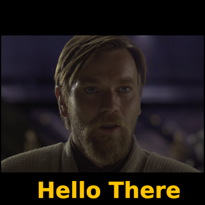
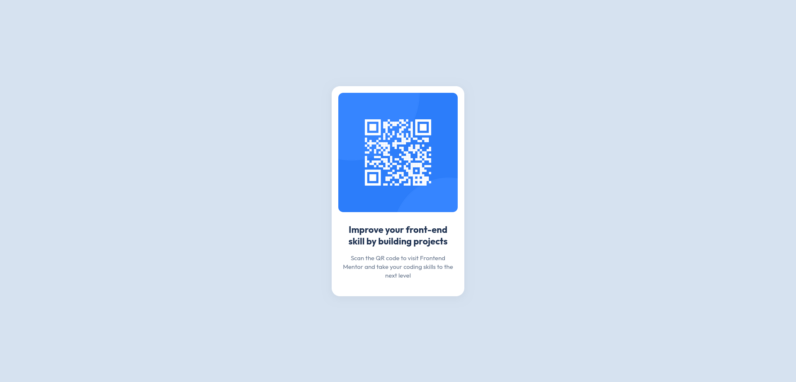

# Frontend Mentor - QR code component



Hello there, i`m Rodolfo Brand and this is my solution to the [QR code component challenge on Frontend Mentor](https://www.frontendmentor.io/challenges/qr-code-component-iux_sIO_H). I appreciate Frontend Mentor for making this challenge available.

## Table of contents

- [Overview](#overview)
  - [Screenshot](#screenshot)
  - [Links](#links)
- [My process](#my-process)
  - [Built with](#built-with)
  - [What I learned](#what-i-learned)
  - [Continued development](#continued-development)
  - [Useful resources](#useful-resources)
- [Author](#author)

## Overview

### Screenshot



### Links

- Solution URL: [qr-code-challenge](https://www.frontendmentor.io/solutions/qr-code-challenge-Y7D2iMiDUu)
- Live Site URL: [Netlify](https://heartfelt-salamander-c5ea3a.netlify.app/)
- Live Site URL: [GithubPages](https://rodolfo-brand.github.io/challenge-qr-code-component/)

## My process

### Built with
<svg xmlns="http://www.w3.org/2000/svg" height="32" width="24" viewBox="0 0 384 512"><!--!Font Awesome Free 6.7.2 by @fontawesome - https://fontawesome.com License - https://fontawesome.com/license/free Copyright 2025 Fonticons, Inc.--><path fill="#FFD43B" d="M0 32l34.9 395.8L191.5 480l157.6-52.2L384 32H0zm308.2 127.9H124.4l4.1 49.4h175.6l-13.6 148.4-97.9 27v.3h-1.1l-98.7-27.3-6-75.8h47.7L138 320l53.5 14.5 53.7-14.5 6-62.2H84.3L71.5 112.2h241.1l-4.4 47.7z"/></svg> html5

<svg xmlns="http://www.w3.org/2000/svg" height="32" width="24" viewBox="0 0 384 512"><!--!Font Awesome Free 6.7.2 by @fontawesome - https://fontawesome.com License - https://fontawesome.com/license/free Copyright 2025 Fonticons, Inc.--><path fill="#6e5da2" d="M0 32l34.9 395.8L192 480l157.1-52.2L384 32H0zm313.1 80l-4.8 47.3L193 208.6l-.3 .1h111.5l-12.8 146.6-98.2 28.7-98.8-29.2-6.4-73.9h48.9l3.2 38.3 52.6 13.3 54.7-15.4 3.7-61.6-166.3-.5v-.1l-.2 .1-3.6-46.3L193.1 162l6.5-2.7H76.7L70.9 112h242.2z"/></svg> css3

### What I learned

I really enjoyed to try and make the content responsive in multiple screen sizes. For that i set the minimum height of body to 100% viewport height (vh), and used relative measurements, such as vh and rem on css, to ensure that the content adapts itself according to the screen size.

```css
body {
    min-height: 100vh;
    display: flex;
    justify-content: center;
    align-items: center;
}

.qrbox {
    max-width: 320px;
    padding: 1rem;
    border-radius: 1.25rem;
}

```

### Continued development

I would love to have some personal made qr-codes of things i created from scratch. With this challenge i perceived some gaps in my code and semantics. I hope in the future i'll be able to better organize my projects.

### Useful resources

- [DeepSeek](https://www.deepseek.com/) - I highly recommend anyone doing this challenge to learn how to use ai in your favour. I personally like Deepseek, but i`m sure that Gemini, ChatGPT, Copilot and others would be just as fine as well.

    An example of how i use deepseek is to better understand what kind of measurement should i use for my project, is it absolute or relative? How should i adress the colors on css? Hex, RGB, HSL?

    The R1 deepthink feature of deepseek is particularly useful for morre elaborate answers

- [Linux Mint](https://linuxmint.com/) - I love this operating system because it`s open source, has a good resemblance with windows, is easy to use, and for my personal favorite, has a built-in terminal to use Git.


## Author
- Frontend Mentor - [@rodolfo-brand](https://www.frontendmentor.io/profile/rodolfo-brand)
- Github - [@rodolfo-brand](https://github.com/rodolfo-brand)